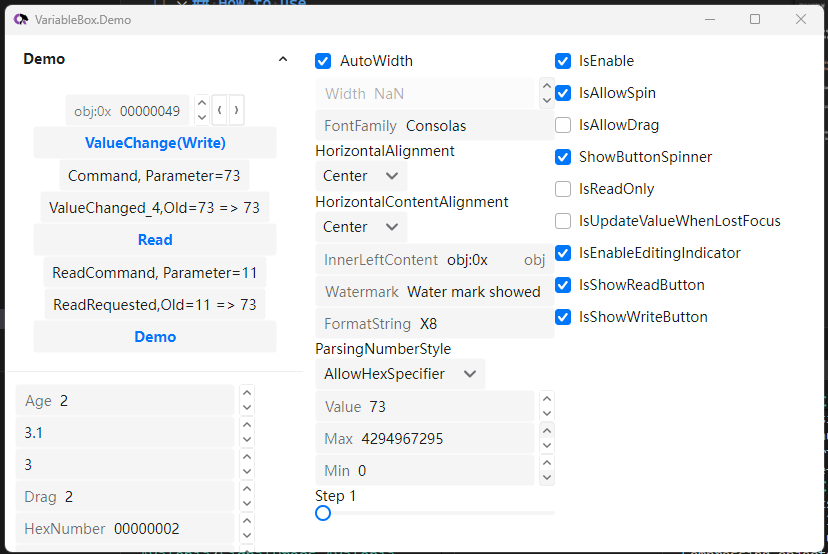

# VariableBox

[](https://github.com/heartacker/VariableBox.Avalonia)
[](https://github.com/heartacker/VariableBox.Avalonia/releases)
[](https://www.nuget.org/packages/VariableBox.Avalonia)

[](https://www.nuget.org/packages/VariableBox.Avalonia.Themes.Semi)


<p align="center">
    
</p>

VariableBox is a UI library for building cross-platform UIs with Avalonia UI.


## How to use

### VariableBox

Add nuget package:
```bash
dotnet add package VariableBox.Avalonia
```

You can now use Ursa controls in your Avalonia Application.
```xml
<Window
    ...
    xmlns:v="VariableBoxUInt"
    ...>
    <StackPanel Margin="20">
        <u:VariableBox Value="{Binding Value}" 
            FormatString="X8"
            HeaderContent="0x"
            ParsingNumberStyle="AllowHexSpecifier"
            Step="2"
            IsEnableEditingIndicator="True"
            />
    </StackPanel>
</Window>
```


### VariableBox.Avalonia.Themes.Semi

To make Ursa controls show up in your application, you need to reference to a theme package designed for VariableBox.

- `VariableBox.Avalonia.Themes.Semi` is a theme package for Ursa inspired by Semi Design. 
   >you need to `add package Semi.Avalonia` frist

- also `VariableBox.Avalonia.Themes.Semi` is compact with `<SimpleTheme/>`
- `VariableBox.Avalonia.Themes.Semi` is NOT compact with `<FluentTheme/>`

You can add it to your project by following steps.

1. Add nuget package:

```bash
dotnet add package Semi.Avalonia
dotnet add package VariableBox.Avalonia.Themes.Semi
```

2. Include Styles in application:
```xml
<Application...
    xmlns:v-semi="using:VariableBox.Avalonia.Themes.Semi"
    ....>

    <Application.Styles>
        <!-- compact theme -->

        <!-- 1. SimpleTheme -->
        <SimpleTheme/>

        <!-- 2. Semi, recommand -->
        <StyleInclude Source="avares://Semi.Avalonia/Themes/Index.axaml" />

        <!-- set this theme -->
        <v-semi:SemiTheme Locale="zh-CN"/>
    </Application.Styles>
```
